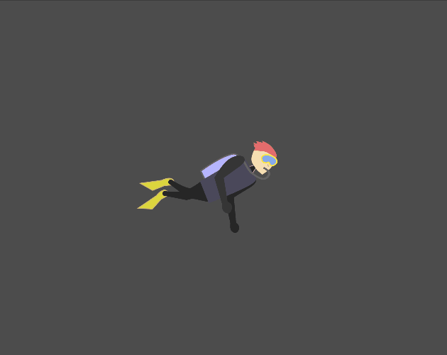

  

  <h3 align="center">DeepDive</h3>
    

    Brackeys Game Jam 2023.2 - "Diving Deeper"
     
    Submission
    

## Description

The objective of DeepDive is to collect garbage and clean up our oceans while avoiding dangerous creatures lurking in the depths.

## Acknowledgments

The sound effects used are taken from here:
- [pickup trash](https://opengameart.org/content/5-break-crunch-impacts)
- [pop bubble](https://opengameart.org/content/bubbles-pop)
- [take damage](https://opengameart.org/content/damage-taken)
- [drown](https://opengameart.org/content/40-cc0-water-splash-slime-sfx)
